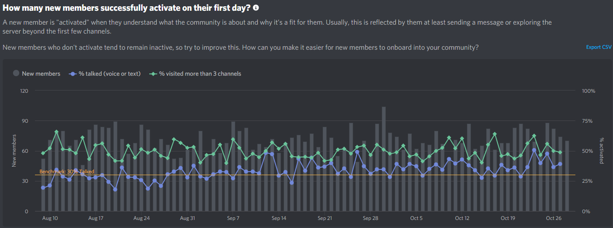

# Final feedback from the 2020 Survey

This information was collected on 30th October 2020, at 19:34 UTC.

One month later than expected and 74 responses in, how did we do?

### The stats

On September 4th, we started changing around channels, archiving old and introducing new ones. Here are the Discord-provided server insights.

Insights shown below are from August 8th, one month prior to the changes, to October 28th as comparison.

**Server leaves** have more or less remained consistent.

**Membership** has increased at the same rate we would've expected pre-survey.

**Activation** has seen a slight increase since the survey changes - which we attribute to the removal of the timer when initially joining.

**Retention** seems to be sporadic and hard to measure. Our best guess is that it is equal or a little more consistent than pre-survey. We will continue to look at this.

**Message activity** seems to have decreased overall - however, there could be multiple factors not in our favour. Many limitations/lockdowns and pandemic changes have since been lifted and Schools have returned. Workplaces have reopened and general Discord usage seeems to be down.

We want to continue monitoring this and provide a better picture come 2021.

### Closing

The 2020 survey provided some actual insight into what members of the guild make of the server as a whole. It has prompted change and it has prompted for a more rapid cycle of changes in the guild.

While the channel switching doesn't seem to have made the impact we wanted, it is a step in the right direction, allowing for new experiments and future surveys to shape the way the C# guild grows.