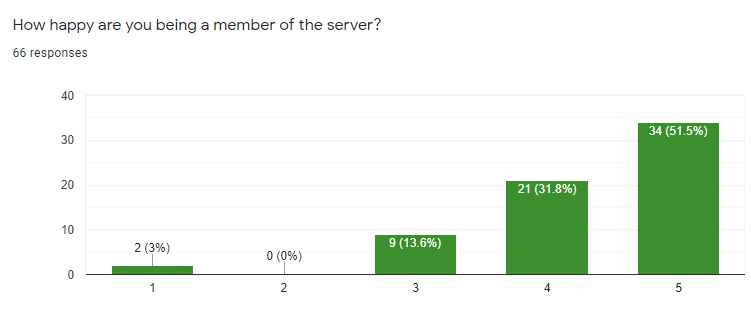
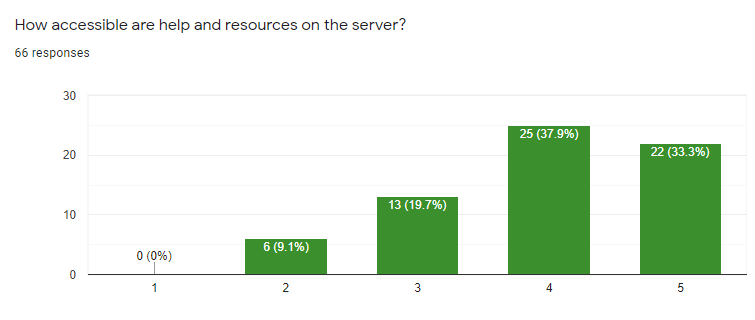
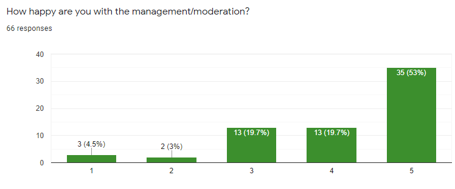
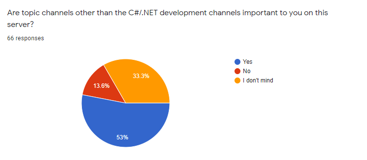

## Initial feedback from the 2020 Survey

This information was collected on 1st September 2020, at 17:25 UTC.

We have so far received 66 responses to the survey, the following is a brief overview of happiness of different areas. We will be sharing a final look at the survey responses once we deem the survey to be closed.

### On server member happiness

The majority of responses have deemed themselves to be happy or very happy on the server, which is our primary goal, as staff.

The overwhelming majority of comments have stated most users are friendly and enjoy livestreams from certain members of the community.

We've been told the 10 minute timer for new members to wait before they can talk is too long. Unfortunately we cannot shorten this timer, as it is set by Discord. We have therefore reduced our verification level to the next step down, which will allow users to talk immediately in the server, providing they have a Discord account older than five minutes. We will be monitoring this and if it negatively impacts or helps raids to occur, we will be resetting this.

### On accessibility of help and resources

We have had feedback that this question should have been split into two - however people have been positive in comments by splitting this out themselves, so we appreciate the effort.

Struggling to keep oversight of resources available, at any level of knowledge, is a struggle for us as a server. We're currently working on a new website to refresh the existing, defunct, website which will hopefully open up a new option for collating resources.

We have had comments that the pins in channels are of low quality and do not help. We will be refreshing these over the coming weeks, with the release of .NET 5.

We have had comments indicating the interest of adding more helper channels - and these requests being ignored. We are of the belief we have not ignored these requests and have responded, with the reasoning that we do not want too many channels and the demand is *just* right for the number of channels we have currently. We are constantly on the analytics observing channel load, and as the server grows, there will, no doubt, be the need for more channels to be created. At this time we (the staff) feel we have an adequate amount.

### On satisifcation of moderation and management

There is a large split of opinion in the comments, the graph itself speaks a different language to the explanations.

We have heard comments that many of our comments seem to insight conflict, or, worse, escalate a situation. We have discussed new approaches and are extremely willing to learn from mistakes - as the server itself, we are constantly iterating and changing moderation style. Since the addition of Mod Mail, we've had an easier time communicating and moderating. We will be using Mod Mail more in future.

As the server grows, it is only inevitable there will be more moderation/incidents - as has already been seen since Discord's Discovery section update. We will talk more about this section once the final post on the survey has been done.

### On the need for off topic channels

The majority of users do not seem to mind or want offtopic channels to be part of the server, so we will push community-orientated channels more than before.

### On the proposed channel list

The majority of comments have indicated that they would not like the proposed layout - and we're therefore no longer pushing for the list in the original survey, but it will remain in the survey for now.

While our intention is to keep this guild C#/.NET-first, people believe the proposed channel list undermines the purpose of the server.

We do want to make changes to how channels are sorted, and we are still discussing/looking at creating a more lax #general channel, where people are not told to move if there happens to be an offtopic conversation.

### On other comments for improvement

We received comments for removing the `Archive` category, that stores all previously active channels that the guild is interested in retaining history for. Although categories are collapsable and mutable, this was a suggestion we wanted to implement, however, after push back from members, we will not be moving any further on this and the archive will remain.

We also received comments about introducing a gated-bot "agree to the rules" concept. We will not be introducing this as it severely impacts accessibility of the server.

We had a suggestion in this section to create a page for users to be able to collate resources - as we previously mentioned, we are actively working on this.

### Closing

For now, this is the update to the survey. There will be another post once we have the final survey and are happy that we have had a large enough response to create a good enough change to the server.

For questions or other comments, please direct them at the #2020-survey at [discord.gg/csharp](https://discord.gg/csharp).